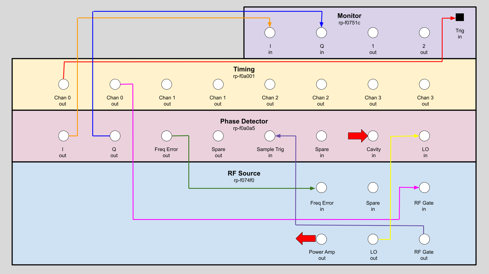
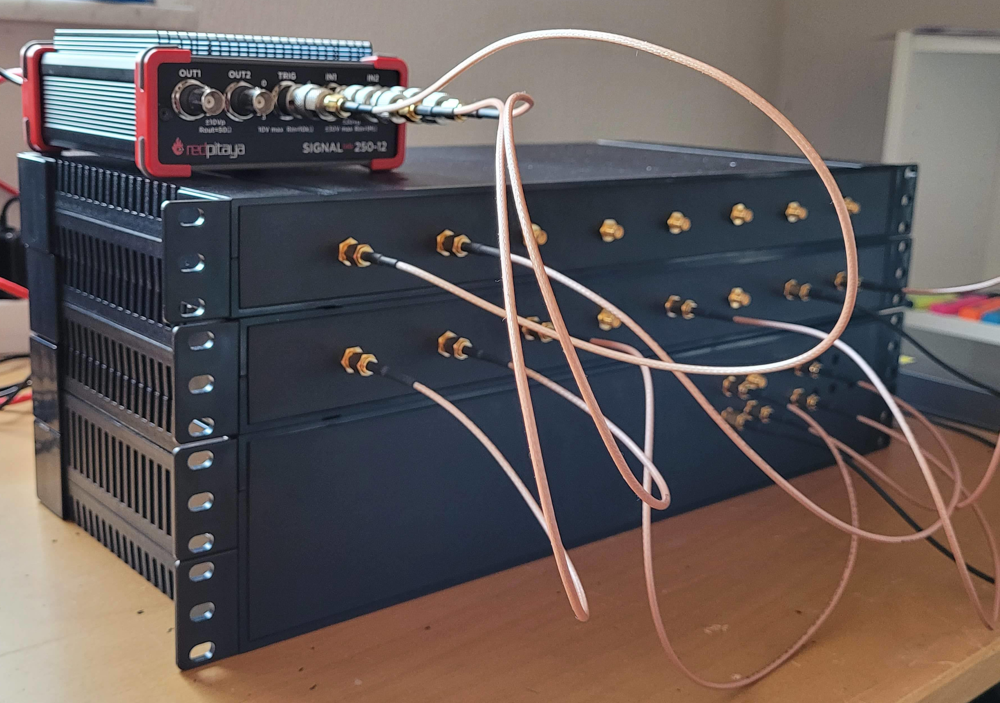

# The Mirrotron RFQ Control System
* <a href="https://github.com/bl-mirrotron" target="_blank">Source code</a>

## Overview
The Mirrotron Radio Frequency Quadrupole (RFQ) is part of a compact neutron source that is being built in Martonvásár Hungary. The compact neutron source consists of five major systems
* 35 keV Hydrogen Ion source
* 2.5 MeV RFQ
* Lithium Target station
* Neutron Instrument stations

The 2.5 MeV RFQ designed and built by Time Co, Ltd., Japan is a pulsed accelerator that can support 1.25 mS pulses at a rate of 40 Hz for a maximum duty factor of 5% . The RFQ can accelerate a peak beam current of 20 mA with an input RF power 260 kW at 200 MHz. providing an average beam power of 2.5 kW. The loaded cavity Q is 10,000 which results in a cavity bandwidth of 20 kHz.

The RFQ accelerator system can be divided into 5 major subsystems
* [RF source (LLRF)](#rf-source)
* Timing system
* 200 MHz RF power amplifier
* Vacuum system
* Cooling system
* [Machine protection system](#machine-protection-system)

## RF source
The RF source is a modular system based on the Red-Pitaya Stemlab 125-14 reconfigurable instrument platform. A modular approach was chosen for design simplicity and future upgrades. Likewise, the Red-Pitaya Stemlab 125-14 was chosen for its ease of use. A block diagram is shown in [Figure 1](#figure-1). The LLRF system comprises of three modules:
- [RF Frequency Source](https://bl-mirrotron.github.io/mirrotron-rf-src-tray/)
- [Four Quadrant IQ Phase Detector](https://bl-mirrotron.github.io/mirrotron-phase-detector-tray/)
- [IQ Monitor System](#iq-monitor-system)

##### Figure 1 #####
*Block diagram of LLRF*

##### Figure 2 #####
*LLRF modules Implementation*

## Machine protection system
More to come
