# The Mirrotron Application Server
* <a href="https://github.com/bl-mirrotron/mirrotron-box" target="_blank">Source code</a>
* [Control system overview](https://docs.bl-mirrotron.com/)

## Functionality
The server for a Mirrotron control system is derived from the Blinky-LiteTMBox as shown in Figure 1. The box can be instantiated on a small computer inside a firewall such as Raspberry Pi 3B+ which is more than adequate for a medium size control system or can be hosted  in the cloud.

The primary tasks of the box are to:
* Subscribe to the messages from all of the trays in the system
* Scan each message for alarm notifications and notify alarm system
* Store the latest messages from in the tray database
* Archive a message when appropriate
* Serve applications to users

The box consists of three components that can reside on the same computer or separate (cloud) computers
* Application server
* MQTT Broker
* System database

## Data logging
As shown in Figure 2, the application server subscribes to all reading and archive messages and sends them to the appropriate document collection. Blinky-LiteTM uses MongoDB as a database. The database can be local or in the cloud. The list of collections are in the database are shown in Figure 3.

## User Access
Blinky-LiteTM uses role-based access with JSON Web Token(JWT) technology for accessing applications as shown in Figure 4. Access and and setting history is logged in the database. Access and setting history apps are also shown in Figure 4.

## Custom Applications
Every custom app is assigned an app slot as shown in Figure 5. The custom app accesses a library of user interface options as shown in Figure 6. Instead of having to write custom code for an app, the custom app is configured in the database as shown in Figure 7. Communications between the client and the server is handled through a websocket router as shown in Figure 8.

## Utility Applications
In addition to custom applications, the Blinky-LiteTM box provides a number of utility applications for handling scalar and vector data as shown in Figure 9. Another utility application is a text-only integrated logbook as shown in Figure 10.

## Machine Permit system
The Machine Permit system is designed to protect the machine from damage. If any scalar cube strays outside the LOLO or HIHI alarm range, the machine permit will publish a message in which one or more critical setting cubes can take action. The machine permit flow is shown in Figure 11. The

Figure 1.  Schematic of a Blinky-LiteTMControl System

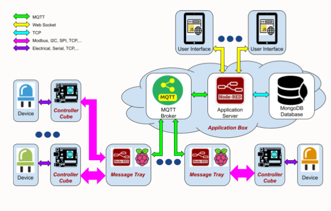
 

Figure 2.  Data Logger Flow

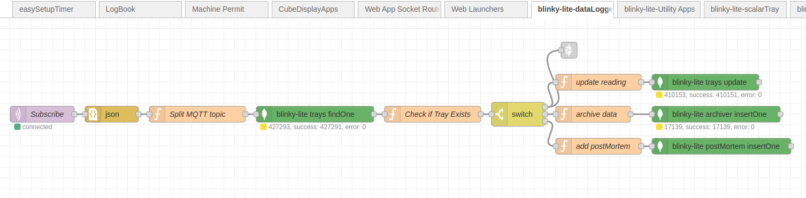
 

Figure 3.  MongoDb Database Flow

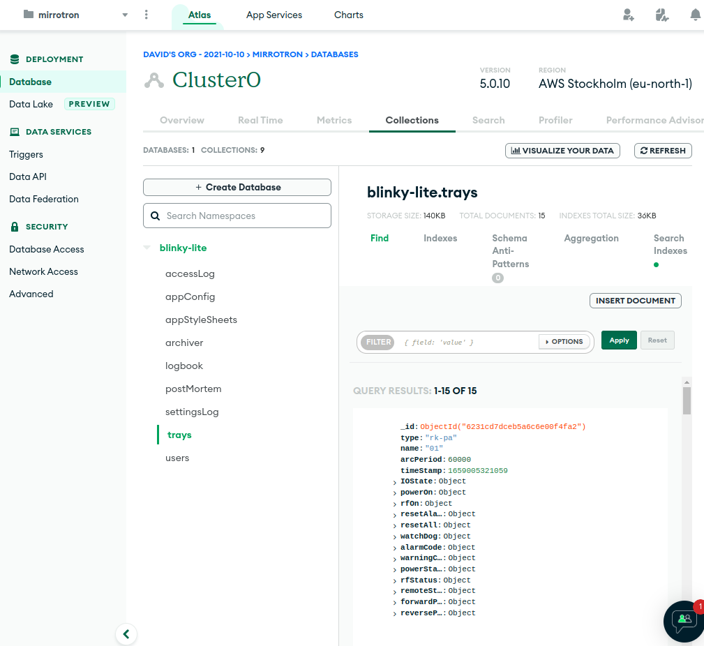
 

Figure 4.  Access Applications Flow

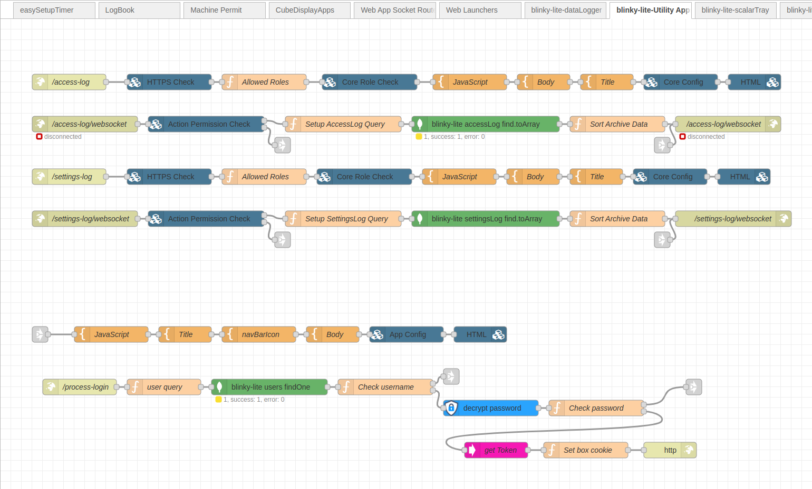
 

Figure 5.  User Application Slots Flow

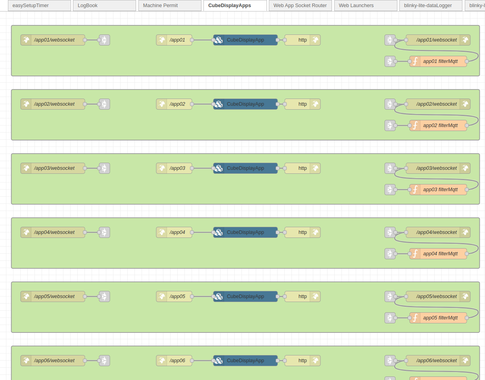
 

Figure 6.  Cube Display App Flow

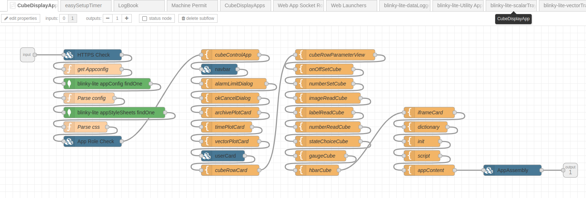
 

Figure 7.  Cube App configuration

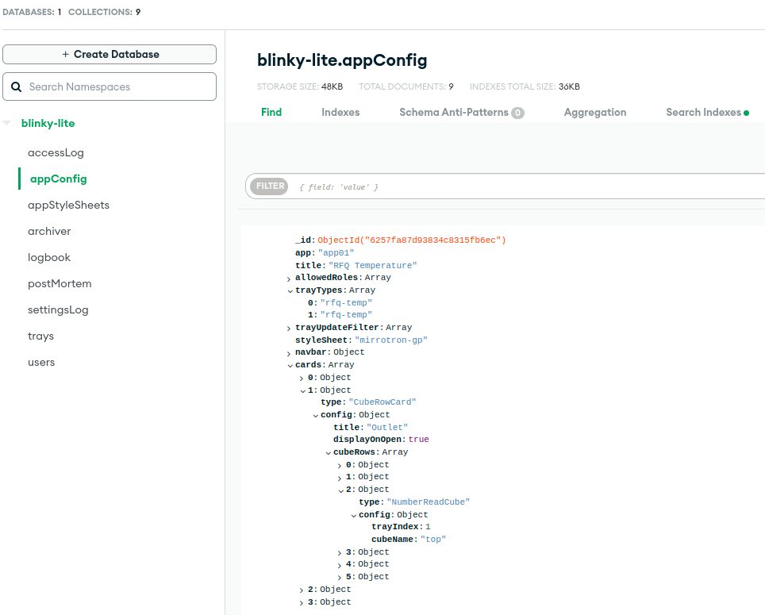
 

Figure 8.  App websocket router

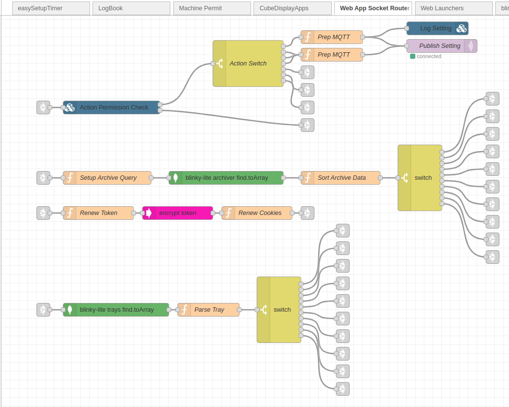
 

Figure 9.  Scalar utility applications flow

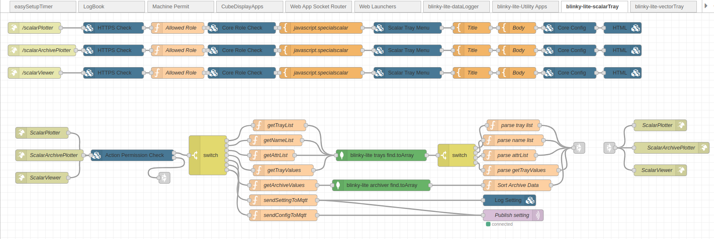
 

Figure 10.  Logbook App Flow 

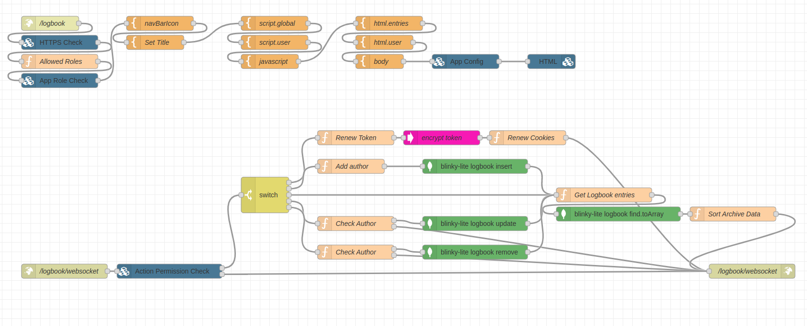
 

Figure 11.  Machine Permit Flow 

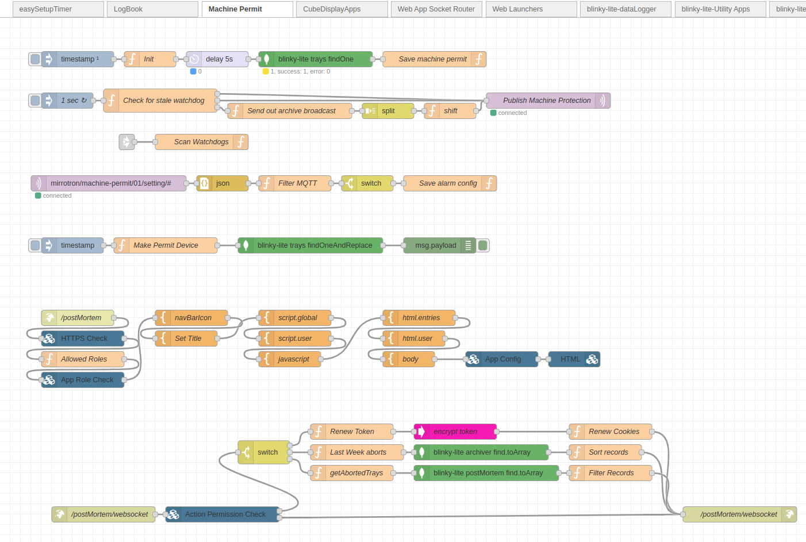
 

Figure 12.  Easy Setup Timer Flow 

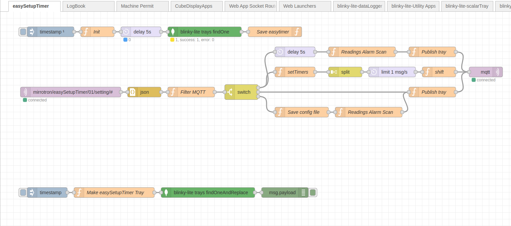
 
